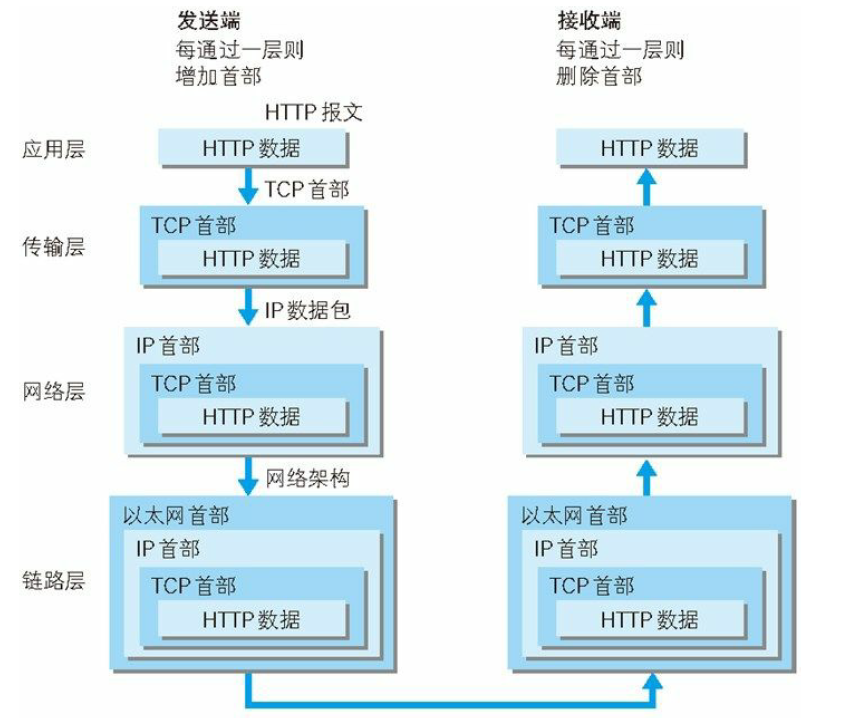
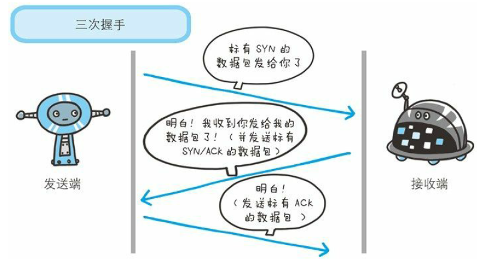
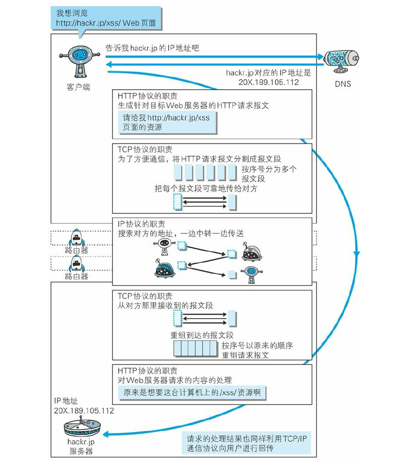

# 第1章 了解Web及网络基础

#### 在浏览器地址栏输入URL时，Web页面呈现过程：

1. 客户端通过指定的访问地址获取（或上传）服务器资源（文件等信息）；
2. 服务器端使用HTTP协议\(超文本传输协议\)进行通信。

#### TCP/IP的分层管理：

* **应用层：**应用层决定了向用户提供应用服务时通信的活动。 TCP/IP协议族内预存了各类

  通用的应用服务。比如，FTP和DNS就是其中的两类。HTTP协议也处于该层。

* **传输层：**传输层对上层应用层，提供处理网络连接中的两台计算机之间的数据传输。协

  议TCP和UDP两种。

* **网络层：**网络层用来处理在网络上流动的数据包。该层规定了通过怎样的路径（所谓的

  传输路线）到达对方计算机，并把数据包传送给对方。与对方计算机之间通过多台计算机或网络设备进行传输时，网络层所起的作用就是在众多的选项内选择一条传输路线。

* **链路层：**用来处理连接网络硬件部分。包括控制操作系统、硬件的设备驱动NIC,及光纤

  等物理可见部分。硬件上的范畴均在链路层的作用范围之内。

#### TCP/IP通信传输示意图:

#### TCP的三次握手:

#### **各个协议与HTTP协议:**

