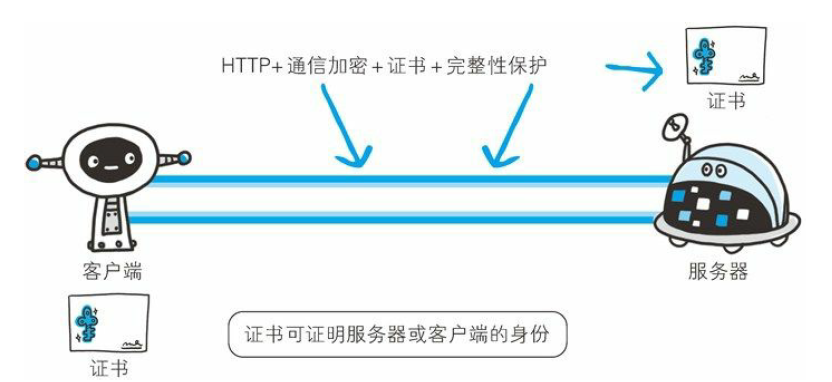
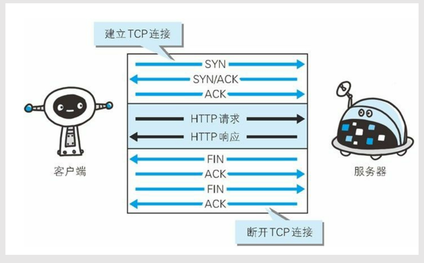
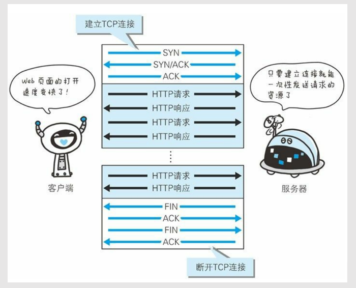
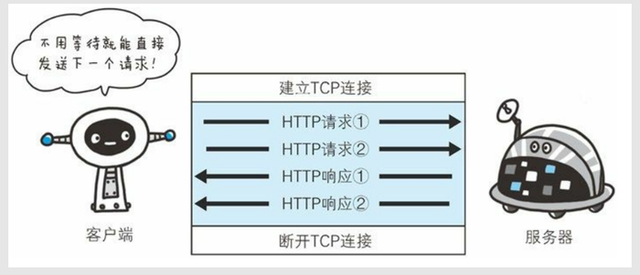

# 第2章 简单的http协议

**GET与POST**

 GET：获取资源

POST：传输实体主体

POST的主要目的并不是获取响应的主体内容。

**HTTP支持的方法**

**HTTPS**

为了保证服务器与客户端信息传递的安全性，需要在HTTP上再加入**加密处理**和**认证等机制**。添加了这种机制的HTTP称为HTTPS\(HTTP Secure\)。

#### 短连接

#### 长链接

#### 管线化

